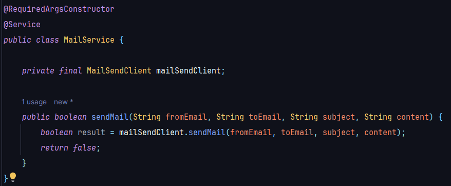
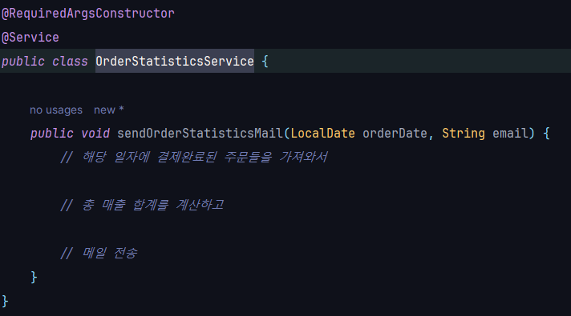
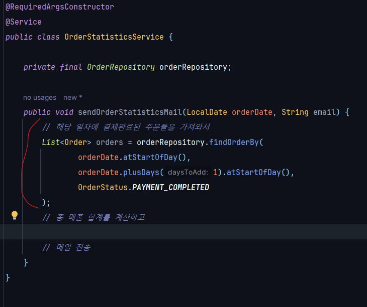
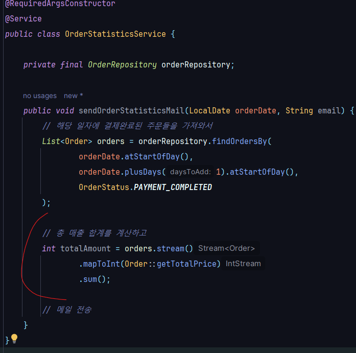
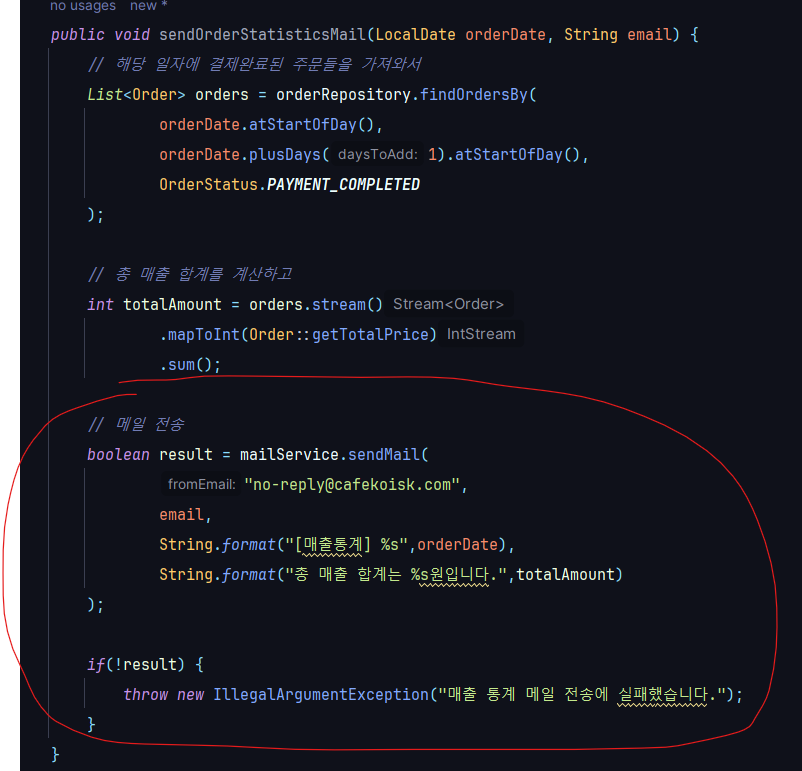

* # 단위 테스트
  * ## 단위 테스트 ?
    * 
  * ## 테스트 케이스 세분화하기
    * ### 경계값 테스트 중요!
      * 
        * #### ex) 어떤 정수가 3이상일 때 a라는 조건을 만족
          * #### 해피 케이스 -> 3(경계값)으로 테스트
          * #### 예외 케이스 -> 2로 테스트
      * 
      * 
  * ## 테스트하기 어려운 영역을 분리하기
    * 
      * ### 테스트 하기 어려움 현재 시간을 넣어주는 로직이 안에 숨어있어서 
      * ### 현재 시간을 외부에서 주입받도록 함
      * 
      * 
        * ### 프로덕션 코드에서는 현재 날짜를 주입해주고, 테스트할 떈 원하는 날짜를 주입해줌
      * ### 테스트하기 어려운 영역을 외부로 분리할수록 테스트 가능한 코드는 많아짐
        * #### 관측할 떄마다 다른 값에 의존하는 코드 -> 현재 날짜/시간, 랜덤 값, 전역 함수/변수, 사용자 입력 등
        * #### 외부 세계에 영향을 주는 코드 -> 표준 출력, 메세지 발송, 데이터베이스에 기록하기 등
        * 
          * #### 함수를 기준으로 들어오는 값에 의존을 하는지 혹은 나가는 값에 의존을 하는지를 보고 판단 할 수 있음
      * ### 같은 입력에는 항상 같은 결과가 나오는 함수가 테스트하기 좋은 함수 -> 순수함수
        * 
      * ### 테스트할 떄 어떤 값을 검증해야 될지 모르겠다 ? -> 외부로 값을 분리 (DI)
  * ## 키워드 
    * 
