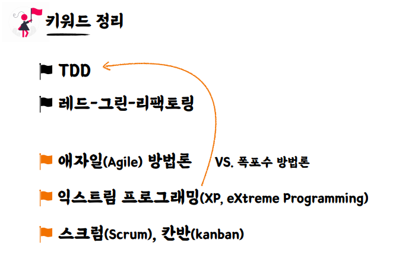

* # 단위 테스트
  * ## 단위 테스트 ?
    * 
  * ## 테스트 케이스 세분화하기
    * ### 경계값 테스트 중요!
      * 
        * #### ex) 어떤 정수가 3이상일 때 a라는 조건을 만족
          * #### 해피 케이스 -> 3(경계값)으로 테스트
          * #### 예외 케이스 -> 2로 테스트
      * 
      * 
  * ## 테스트하기 어려운 영역을 분리하기
    * 
      * ### 테스트 하기 어려움 현재 시간을 넣어주는 로직이 안에 숨어있어서 
      * ### 현재 시간을 외부에서 주입받도록 함
      * 
      * 
        * ### 프로덕션 코드에서는 현재 날짜를 주입해주고, 테스트할 떈 원하는 날짜를 주입해줌
      * ### 테스트하기 어려운 영역을 외부로 분리할수록 테스트 가능한 코드는 많아짐
        * #### 관측할 떄마다 다른 값에 의존하는 코드 -> 현재 날짜/시간, 랜덤 값, 전역 함수/변수, 사용자 입력 등
        * #### 외부 세계에 영향을 주는 코드 -> 표준 출력, 메세지 발송, 데이터베이스에 기록하기 등
        * 
          * #### 함수를 기준으로 들어오는 값에 의존을 하는지 혹은 나가는 값에 의존을 하는지를 보고 판단 할 수 있음
      * ### 같은 입력에는 항상 같은 결과가 나오는 함수가 테스트하기 좋은 함수 -> 순수함수
        * 
      * ### 테스트할 떄 어떤 값을 검증해야 될지 모르겠다 ? -> 외부로 값을 분리 (DI)
  * ## 키워드 
    * 

* # TDD: Test Driven Development
  * ## TDD ?
    * 
    * 
    * ### RED 단계 실습
      * 
        * #### 기존에 구현했던 calculateTotalPrice메서드 삭제
      * 
      * 
        * #### 테스트 작성
      * 
        * #### 실패
    * ### GREEN 단계 실습 -> 빠른 시간 내에 초록불을 본다!
      * 
      * 
    * ### BLUE 단계 -> 리팩터링
      * 
      * 
      * 
        * #### 과감한 리팩터링까진 진행 -> 가능한 이유? 테스트가 우리의 기능 자체를 보장을 해주고 있기 떄문
  * ## 피드백 ? -> TDD의 가장 핵심 가치 
    * ### 작성하는 구현 코드, 프로덕션 코드에 대해서 자주 그리고 빠르게 피드백을 받을 수 있다는 것
  * ## 선 기능 구현, 후 테스트 작성
    * 
  * ## 선 테스트 작성, 후 기능 구현
    * 
      * ### 테스트 부터 작성을 한다면 관점이 테스트를 하기 위한 구조를 고민하게 되는 거임
        * #### ex -> 파라미터로 LocalDateTime을 받아야겠다.. 외부로 테스트하기 어려운 영역을 분리해야겠다라는 생각이 떠오를 수 있음
  * ## TDD: 관점의 변화 -> 클라이언트 관점에서의 피드백을 주는 Test Driven
    * 
      * ### 클라이언트 관점에서 우리의 프로덕션 코드를 볼 수 있게 해주는 도구
  * ## 키워드
    * 

* # 테스트는 []다.
  * ## 테스트는 []다 ?
    * ### 테스트는 문서다 
  * ## 문서 ?
    * 
  * ## DisplayName을 섬세하게
    * 
    * 
    * 
    * 
  * ## BDD 스타일로 작성하기
    * ### BDD ?
      * 
    * ### Given / When/ Then
      * 
      * 
      * 
  * ## 키워드
    * 

