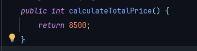
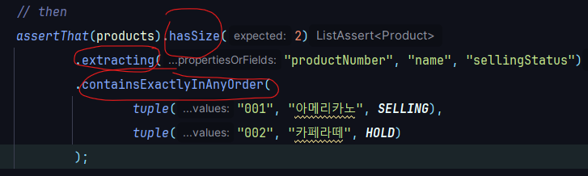
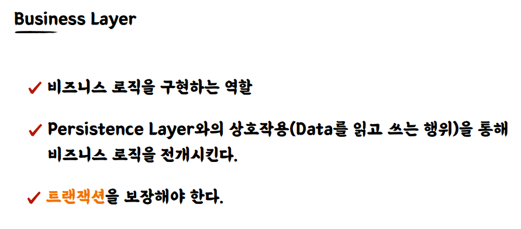

* # 단위 테스트
  * ## 단위 테스트 ?
    * 
  * ## 테스트 케이스 세분화하기
    * ### 경계값 테스트 중요!
      * 
        * #### ex) 어떤 정수가 3이상일 때 a라는 조건을 만족
          * #### 해피 케이스 -> 3(경계값)으로 테스트
          * #### 예외 케이스 -> 2로 테스트
      * 
      * 
  * ## 테스트하기 어려운 영역을 분리하기
    * 
      * ### 테스트 하기 어려움 현재 시간을 넣어주는 로직이 안에 숨어있어서 
      * ### 현재 시간을 외부에서 주입받도록 함
      * 
      * 
        * ### 프로덕션 코드에서는 현재 날짜를 주입해주고, 테스트할 떈 원하는 날짜를 주입해줌
      * ### 테스트하기 어려운 영역을 외부로 분리할수록 테스트 가능한 코드는 많아짐
        * #### 관측할 떄마다 다른 값에 의존하는 코드 -> 현재 날짜/시간, 랜덤 값, 전역 함수/변수, 사용자 입력 등
        * #### 외부 세계에 영향을 주는 코드 -> 표준 출력, 메세지 발송, 데이터베이스에 기록하기 등
        * 
          * #### 함수를 기준으로 들어오는 값에 의존을 하는지 혹은 나가는 값에 의존을 하는지를 보고 판단 할 수 있음
      * ### 같은 입력에는 항상 같은 결과가 나오는 함수가 테스트하기 좋은 함수 -> 순수함수
        * 
      * ### 테스트할 떄 어떤 값을 검증해야 될지 모르겠다 ? -> 외부로 값을 분리 (DI)
  * ## 키워드 
    * 

* # TDD: Test Driven Development
  * ## TDD ?
    * 
    * 
    * ### RED 단계 실습
      * 
        * #### 기존에 구현했던 calculateTotalPrice메서드 삭제
      * 
      * 
        * #### 테스트 작성
      * 
        * #### 실패
    * ### GREEN 단계 실습 -> 빠른 시간 내에 초록불을 본다!
      * 
      * 
    * ### BLUE 단계 -> 리팩터링
      * 
      * 
      * 
        * #### 과감한 리팩터링까진 진행 -> 가능한 이유? 테스트가 우리의 기능 자체를 보장을 해주고 있기 떄문
  * ## 피드백 ? -> TDD의 가장 핵심 가치 
    * ### 작성하는 구현 코드, 프로덕션 코드에 대해서 자주 그리고 빠르게 피드백을 받을 수 있다는 것
  * ## 선 기능 구현, 후 테스트 작성
    * 
  * ## 선 테스트 작성, 후 기능 구현
    * 
      * ### 테스트 부터 작성을 한다면 관점이 테스트를 하기 위한 구조를 고민하게 되는 거임
        * #### ex -> 파라미터로 LocalDateTime을 받아야겠다.. 외부로 테스트하기 어려운 영역을 분리해야겠다라는 생각이 떠오를 수 있음
  * ## TDD: 관점의 변화 -> 클라이언트 관점에서의 피드백을 주는 Test Driven
    * 
      * ### 클라이언트 관점에서 우리의 프로덕션 코드를 볼 수 있게 해주는 도구
  * ## 키워드
    * 

* # 테스트는 []다.
  * ## 테스트는 []다 ?
    * ### 테스트는 문서다 
  * ## 문서 ?
    * 
  * ## DisplayName을 섬세하게
    * 
    * 
    * 
    * 
  * ## BDD 스타일로 작성하기
    * ### BDD ?
      * 
    * ### Given / When/ Then
      * 
      * 
      * 
  * ## 키워드
    * 

* # Spring & JPA 기반 테스트
  * ## 레이어드 아키텍처(Layered Architecture)와 테스트
    * ### 레이어를 나눈 이유 -> 관심사를 나누기 위해
    * 
  * ## 통합 테스트 ?
    * ### 필요한 이유 ? -> A 더하기 B가 AB라는 보장이 없으니깐 
    * 
  * ## Spring / JPA 훑어보기 & 기본 엔티티 설계
    * ### Library vs Framework
      * #### Library : 내 코드가 주체가 되서 필요한 기능이 있다면 외부에서 끌어와서 사용하게 되는 것들 (내 코드가 주체..능동적)
      * #### Framework : 이미 갖춰진 동작할 수 있는 그런 환경들이 구성 되어있고 내 코드가 수동적으로 프레임워크 안에서 역할을 하게되는 것 (수동적...)
      * 
    * ### Spring
      * 
    * ### JPA
      * ### ORM
        * 
        * 
      * ### JPA
        * 
        * 
        * 
    * ### 엔티티 설계
      * 
      * 
  * ## Persistence Layer 테스트 (1)
    * 
    * 
      * ### @MappedSuperclass 
        * #### -> **JPA(Java Persistence API)**에서 사용되며, 엔티티 클래스들이 상속받을 수 있는 공통 부모 클래스를 정의할 때 사용
        * #### -> @MappedSuperclass로 지정된 클래스는 엔티티가 아니기 때문에 테이블에 직접 매핑되지 않습니다. 하지만, 상속받는 클래스가 실제 엔티티일 경우, BaseEntity의 필드들이 상속 엔티티 테이블의 컬럼으로 매핑
      * ### @EntityListeners(AuditingEntityListener.class)
        * #### -> JPA 엔티티의 변경 사항을 감지하고, 이를 처리할 수 있도록 이벤트 리스너를 등록하는 데 사용되는 애너테이션
        * #### -> *AuditingEntityListener**는 엔티티의 생성/수정 시간을 자동으로 기록하는 JPA 감사 기능(Auditing)을 제공하는 리스너입니다. 이를 통해 데이터가 언제 생성되었고, 언제 수정되었는지 자동으로 기록
      * ### @CreatedDate
        * #### -> JPA의 Auditing 기능을 활성화했을 때 사용
        * #### -> 해당 엔티티가 처음 저장될 때의 시간을 자동으로 기록합니다. 즉, 엔티티가 처음 생성되어 DB에 저장될 때 createdDateTime 필드에 해당 시점이 기록
      * ### @LastModifiedDate
        * #### -> 마찬가지로 JPA Auditing 기능을 이용하여, 엔티티가 수정될 때의 시간을 자동으로 기록
        * #### -> 티티가 업데이트될 때마다 modifiedDateTime 필드에 해당 시점이 저장
      * 
        * ####  JPA Auditing 기능을 사용한다고 SpringBoot에게 알려줘야함
      * 
    * ### application.yml 
      * 
      * 
        * #### Spring Profiles : Default : local -> 프로파일을 지정하지 않으면 항상 하위에 있는 Local Profile로 뜬다를 기본으로 설정 
        * #### DataSource 기본을 h2로 지정 -> MYSQL, Oracle..변환 가능
        * #### ddl-auto : none -> 기본설정을 none으로 지정, local, test에서만 create로 지정 
          * #### create, create-drop : DDL 자체를 서버가 뜰 때 새로 만들 것인가, create-drop은 새로 만들었다가 서버가 내려갈 떄 드랍이 되어버림
          * #### -> 매번 테스트를 하기 위해서 DDL 할 필요가 없어짐 (jpa entity기반으로 테이블 생성해줌)
        * ####  defer-datasource-initialization: true -> 매번 데이터 생성하는 번거러움을 제거해줌, data.sql파일에 있는 sql문을 실행시켜줌
          * 
            * #### Hibernate 초기화 이후 data.sql 실행시켜줌 
            * #### Hibernate가 초기화 되어야 테이블 정보가 생성됨
      * 
        * #### 테스트용 Profile -> 테스트를 실행할 때는 이 프로파일로 테스트 프로파일로 돌리도록 함
        * #### mode : never -> data.sql을 사용하지 않을거라서 설정해둠
    * ### ProductEntity
      * 
    * ### ProductRepository
      * 
    * ### ProductService
      * 
    * ### ProductController
      * 
    * ### 실행결과
      * 

  * ## Persistence Layer 테스트 (2)
    * ### 리포지토리테스트 -> 단위 테스트 성격에 가까움 why? 데이터베이스에 액세스하는 로직만 가지고 있기 때문에
    * ### @SpringBootTest : Spring 서버를 띄워서 테스트할 수 있음
    * ### @DataJpaTest : 애도 Spring 서버를 띄움 but @SpringBootTest보다 가벼움 why? jpa 관련된 빈들만 주입을 해줘서 서버를 띄우기 때문에
    * 
      * #### list테스트할 때 주로 쓰는 메서드들
    * 
      * #### ActiveProfiles("test") -> test Profile을 쓰겠다라는 뜻 (data.sql파일 실행X)

  * ## Business Layer 테스트 (1)
    * ### Persistence Layer ?
      * 
      * 
    * ### Business Layer ?
      * 
      * 
    * ### 요구사항
      * 
    * ### OrderEntity, OrderStatus 생성
      * 
    * ### 관계형 Entity인 OrderProduct 생성
      * 
    * ### OrderController 생성
      * 
    * ### OrderCreateRequest 생성
      * 
    * ### OrderService 생성
      * 
    * ### OrderResponse 생성
      * 
    * ### OrderServiceTest -> Red 단계 
      * 
      * 
    * ### OrderServiceTest -> Green 단계
      * 
      * 
      * 
      * 
      * 
        * #### OrderEntity, OrderTest (단위 테스트)
          * 
          * 
            * #### 실패 (Red 단계)
          * 
            * #### OrderTest 다시 돌려보면 성공 (Green 단계)
          * 
            * #### 리팩터링 -> 메서드 분리 (Blue 단계) 
        * #### 주문 등록날짜시간을 외부에서 주입받도록 -> 테스트하기 쉽게
          * 
          * 
          * 
          * 
        * #### OrderProduct 만들기
          * 
        * #### OrderResponse에 맵핑메서드 추가
          * 
          * 
        * #### OrderRepository 생성
          * 
          * 
            * #### save를 해야 pk인 id값이 존재하기 때문에
        * #### 다시 OrderServiceTest 실행 성공 -> LocalDateTime 변수로 뽑고, ActiveFile("test") 지정
          * 
        * #### 중복되는 상품번호 리스트로 주문을 생성할 수 있다 -> 테스트 코드 작성 (Red 단계)
          *  
          * #### 중복되는 번호에는 반환되는 데이터가 중복제거되어서 나옴
            * 
          * #### Map을 활용하여 상품번호(key),상품(value)로 저장하여 productNumbers를 다시 순회하면서 상품을 꺼내옴 (Green 단계)
            * 
          * #### 테스트 성공
    * ### OrderService 리팩토링 -> Blue 단계
      * 
        * #### 리팩토링 후 항상 다시 테스트 돌려볼 것 정상동작하는지
    * ### OrderService테스트 두개의 메서드가 서로 영향을 주고 있어서 전체 테스트 시 실패함 -> @AfterEach를 이용하여 데이터 클렌징 작업해줘야함
      * 
        * #### 데이터 지우는 순서 중요
      * #### OrderProductRepository 생성 -> 해당 엔티티에 쌓이는 데이터도 지워줘야하기때문
        * 
        * 
      * #### ProductRepositoryTest는 데이터 클랜징을 안해줘도 자동 롤백이 됨 why? 메타 애너테이션으로 @Transactional을 가지고 있음
        * 
    * ### httpie를 이용한 Controller 엔드포인트 테스트
      * 
      * 
    * ### OrderProduct엔티티에 order_id값이 어떻게 저장되는가 ?
      * 
  * ##  Business Layer 테스트 (3)
    * ### 요구사항 추가 -> "재고와 관련된 상품이 포함되어 있는 주문번호 리스트를 받아 주문을 생성한다" 테스트 작성 (Red 단계) 
      * 
    * ### @AfterEach 주석처리하고 @Transactinal 추가
      * 
    * ### StockEntity 생성
      * 
    * ### StockRepository 생성
      * 
    * ### OrderServiceTest -> Red 단계
      * #### 테스트 작성 -> 재고상품 저장, 재고 갯수가 제대로 줄었는지 확인 -> 실패
        * 
        * 
    * ### OrderService 구현 -> Green 단계
      * 
        * #### 1 . 재고 차감 체크가 필요한 상품들 filter 구현
          * #### 재고와 관련 있는 상품들의 타입을 filtering해주기 위해 ProductType에 메서드 추가
            * 
          * #### ProductType 단위 테스트 
            * 
      * #### 2 . 재고 엔티티 조회
        * #### StockRepository에 메서드 추가
          * 
        * #### StockRepository 테스트
          * 
      * #### 3 . 상품별 counting (key = productNumber, vale = counting)
        * 
        * ```java
               Map<String, Long> productCountingMap = new HashMap<>();
                         for (String productNumber : stockProductNumbers) {
                               productCountingMap.put(productNumber, productCountingMap.getOrDefault(productNumber, 0L) + 1);
                         }
        ```
      * #### 4 . 재고 차감 시도
        * #### Stock에 있는 quantity의 개수보다 요청으로 들어온 quantity가 더 많으면 예외를 발생시켜야함
          * 
        * #### 많지 않다면 재고 차감 진행
          * 
        * #### Stock 단위 테스트
          * 
          * 
        * #### 만약 재고보다 많은 수의 수량으로 차감 시도하면 예외 던지기
          * 
          * 
        * #### 서비스로직에서 검사를 하는데 굳이 왜 deductQuantity에서도 검사하는지?
          * #### 서비스로직에서만 쓴다는 보장이 없는 메서드이므로 deductQuantity메서드 자체에서도 보장을 해줘야함
          * #### 서비스로직에서 그럼 if문을 없애도 되지않나? -> 예외가 발생했을 떄 반환하고 싶은 메세지가 다를 수도 있기 떄문에 (사용자단까지 보여줘야할 메세지라면 Stock에서 내뱉는 메세지와 달라야함)
      * #### 재고 차감 시도에서 중복되는 001에 대한 상품을 중복횟수만큼 for문을 돌아서 테스트 실패함 (재고부족)
        * 
        * 
          * #### 중복제거를 하기위해 자료형 Set에 넣어줌 -> 테스트 성공
      * #### 테스트 작성 -> 재고가 부족한 상품으로 주문을 생성하려는 경우 예외가 발생하는지
        * 
        * 
          * #### 이렇게 작성하면 안된다는 것을 알리기 위해 todo를 남김
    * ### @Transactional 주석처리하고, deleteAllInBatch로 후속처리 -> 실패
      * 
        * #### 실행했을떄 쿼리결과를 보면 stock에 대한 quantity 차감시 update쿼리문이 나가지 않았음 -> 실패 원인
      * #### OrderService에 @Transactional를 달아주면 테스트가 통과함 -> 즉 Tx경계가 있어야 테스트 성공을 함 (Jpa의 Duty Checking기능이 작동하려면)
        * 
      * #### <strong> @Transactional을 잘 알고 쓰자! </strong>
        * #### OrderServiceTest 상에서 @Transactional을 달아주면 테스트가 잘 통과 
        * #### 하지만 실제 프로덕션 코드에서는 @Transactional이 설정되있지 않았음 -> 이대로 배포가 된다면 큰결함이 발생
        * #### 근데 어떻게 insert쿼리는 잘 나간거지 ? -> JpaReposiotry의 구현체인 SimpleJpaRepository에 @Transactional이 걸려있음
          * 
        * #### <strong>변경감지는 우리가 경계를 설정해줘야함</strong> 
    * ### OrderService 리팩터링 -> Blue 단계
      * #### 재고 차감 로직을 메서드로 분리
        * 
      * #### 가공 로직을 메서드로 분리 
        * 
      * #### 테스트 실행 -> 성공
    * ### 재고 관리 -> 동시성 고민
      * 
