* # 단위 테스트
  * ## 단위 테스트 ?
    * 
  * ## 테스트 케이스 세분화하기
    * ### 경계값 테스트 중요!
      * 
        * #### ex) 어떤 정수가 3이상일 때 a라는 조건을 만족
          * #### 해피 케이스 -> 3(경계값)으로 테스트
          * #### 예외 케이스 -> 2로 테스트
      * 
      * 
  * ## 테스트하기 어려운 영역을 분리하기
    * 
      * ### 테스트 하기 어려움 현재 시간을 넣어주는 로직이 안에 숨어있어서 
      * ### 현재 시간을 외부에서 주입받도록 함
      * 
      * 
        * ### 프로덕션 코드에서는 현재 날짜를 주입해주고, 테스트할 떈 원하는 날짜를 주입해줌
      * ### 테스트하기 어려운 영역을 외부로 분리할수록 테스트 가능한 코드는 많아짐
        * #### 관측할 떄마다 다른 값에 의존하는 코드 -> 현재 날짜/시간, 랜덤 값, 전역 함수/변수, 사용자 입력 등
        * #### 외부 세계에 영향을 주는 코드 -> 표준 출력, 메세지 발송, 데이터베이스에 기록하기 등
        * 
          * #### 함수를 기준으로 들어오는 값에 의존을 하는지 혹은 나가는 값에 의존을 하는지를 보고 판단 할 수 있음
      * ### 같은 입력에는 항상 같은 결과가 나오는 함수가 테스트하기 좋은 함수 -> 순수함수
        * 
      * ### 테스트할 떄 어떤 값을 검증해야 될지 모르겠다 ? -> 외부로 값을 분리 (DI)
  * ## 키워드 
    * 

* # TDD: Test Driven Development
  * ## TDD ?
    * 
    * 
    * ### RED 단계 실습
      * 
        * #### 기존에 구현했던 calculateTotalPrice메서드 삭제
      * 
      * 
        * #### 테스트 작성
      * 
        * #### 실패
    * ### GREEN 단계 실습 -> 빠른 시간 내에 초록불을 본다!
      * 
      * 
    * ### BLUE 단계 -> 리팩터링
      * 
      * 
      * 
        * #### 과감한 리팩터링까진 진행 -> 가능한 이유? 테스트가 우리의 기능 자체를 보장을 해주고 있기 떄문
  * ## 피드백 ? -> TDD의 가장 핵심 가치 
    * ### 작성하는 구현 코드, 프로덕션 코드에 대해서 자주 그리고 빠르게 피드백을 받을 수 있다는 것
  * ## 선 기능 구현, 후 테스트 작성
    * 
  * ## 선 테스트 작성, 후 기능 구현
    * 
      * ### 테스트 부터 작성을 한다면 관점이 테스트를 하기 위한 구조를 고민하게 되는 거임
        * #### ex -> 파라미터로 LocalDateTime을 받아야겠다.. 외부로 테스트하기 어려운 영역을 분리해야겠다라는 생각이 떠오를 수 있음
  * ## TDD: 관점의 변화 -> 클라이언트 관점에서의 피드백을 주는 Test Driven
    * 
      * ### 클라이언트 관점에서 우리의 프로덕션 코드를 볼 수 있게 해주는 도구
  * ## 키워드
    * 

* # 테스트는 []다.
  * ## 테스트는 []다 ?
    * ### 테스트는 문서다 
  * ## 문서 ?
    * 
  * ## DisplayName을 섬세하게
    * 
    * 
    * 
    * 
  * ## BDD 스타일로 작성하기
    * ### BDD ?
      * 
    * ### Given / When/ Then
      * 
      * 
      * 
  * ## 키워드
    * 

* # Spring & JPA 기반 테스트
  * ## 레이어드 아키텍처(Layered Architecture)와 테스트
    * ### 레이어를 나눈 이유 -> 관심사를 나누기 위해
    * 
  * ## 통합 테스트 ?
    * ### 필요한 이유 ? -> A 더하기 B가 AB라는 보장이 없으니깐 
    * 
  * ## Spring / JPA 훑어보기 & 기본 엔티티 설계
    * ### Library vs Framework
      * #### Library : 내 코드가 주체가 되서 필요한 기능이 있다면 외부에서 끌어와서 사용하게 되는 것들 (내 코드가 주체..능동적)
      * #### Framework : 이미 갖춰진 동작할 수 있는 그런 환경들이 구성 되어있고 내 코드가 수동적으로 프레임워크 안에서 역할을 하게되는 것 (수동적...)
      * 
    * ### Spring
      * 
    * ### JPA
      * ### ORM
        * 
        * 
      * ### JPA
        * 
        * 
        * 
    * ### 엔티티 설계
      * 
      * 
  * ## Persistence Layer 테스트 (1)
    * 
    * 
      * ### @MappedSuperclass 
        * #### -> **JPA(Java Persistence API)**에서 사용되며, 엔티티 클래스들이 상속받을 수 있는 공통 부모 클래스를 정의할 때 사용
        * #### -> @MappedSuperclass로 지정된 클래스는 엔티티가 아니기 때문에 테이블에 직접 매핑되지 않습니다. 하지만, 상속받는 클래스가 실제 엔티티일 경우, BaseEntity의 필드들이 상속 엔티티 테이블의 컬럼으로 매핑
      * ### @EntityListeners(AuditingEntityListener.class)
        * #### -> JPA 엔티티의 변경 사항을 감지하고, 이를 처리할 수 있도록 이벤트 리스너를 등록하는 데 사용되는 애너테이션
        * #### -> *AuditingEntityListener**는 엔티티의 생성/수정 시간을 자동으로 기록하는 JPA 감사 기능(Auditing)을 제공하는 리스너입니다. 이를 통해 데이터가 언제 생성되었고, 언제 수정되었는지 자동으로 기록
      * ### @CreatedDate
        * #### -> JPA의 Auditing 기능을 활성화했을 때 사용
        * #### -> 해당 엔티티가 처음 저장될 때의 시간을 자동으로 기록합니다. 즉, 엔티티가 처음 생성되어 DB에 저장될 때 createdDateTime 필드에 해당 시점이 기록
      * ### @LastModifiedDate
        * #### -> 마찬가지로 JPA Auditing 기능을 이용하여, 엔티티가 수정될 때의 시간을 자동으로 기록
        * #### -> 티티가 업데이트될 때마다 modifiedDateTime 필드에 해당 시점이 저장
      * 
        * ####  JPA Auditing 기능을 사용한다고 SpringBoot에게 알려줘야함
      * 
    * ### application.yml 
      * 
      * 
        * #### Spring Profiles : Default : local -> 프로파일을 지정하지 않으면 항상 하위에 있는 Local Profile로 뜬다를 기본으로 설정 
        * #### DataSource 기본을 h2로 지정 -> MYSQL, Oracle..변환 가능
        * #### ddl-auto : none -> 기본설정을 none으로 지정, local, test에서만 create로 지정 
          * #### create, create-drop : DDL 자체를 서버가 뜰 때 새로 만들 것인가, create-drop은 새로 만들었다가 서버가 내려갈 떄 드랍이 되어버림
          * #### -> 매번 테스트를 하기 위해서 DDL 할 필요가 없어짐 (jpa entity기반으로 테이블 생성해줌)
        * ####  defer-datasource-initialization: true -> 매번 데이터 생성하는 번거러움을 제거해줌, data.sql파일에 있는 sql문을 실행시켜줌
          * 
            * #### Hibernate 초기화 이후 data.sql 실행시켜줌 
            * #### Hibernate가 초기화 되어야 테이블 정보가 생성됨
      * 
        * #### 테스트용 Profile -> 테스트를 실행할 때는 이 프로파일로 테스트 프로파일로 돌리도록 함
        * #### mode : never -> data.sql을 사용하지 않을거라서 설정해둠
    * ### ProductEntity
      * 
    * ### ProductRepository
      * 
    * ### ProductService
      * 
    * ### ProductController
      * 
    * ### 실행결과
      * 

  * ## Persistence Layer 테스트 (2)
    * ### 리포지토리테스트 -> 단위 테스트 성격에 가까움 why? 데이터베이스에 액세스하는 로직만 가지고 있기 때문에
    * ### @SpringBootTest : Spring 서버를 띄워서 테스트할 수 있음
    * ### @DataJpaTest : 애도 Spring 서버를 띄움 but @SpringBootTest보다 가벼움 why? jpa 관련된 빈들만 주입을 해줘서 서버를 띄우기 때문에
    * 
      * #### list테스트할 때 주로 쓰는 메서드들
    * 
      * #### ActiveProfiles("test") -> test Profile을 쓰겠다라는 뜻 (data.sql파일 실행X)

  * ## Business Layer 테스트 (1)
    * ### Persistence Layer ?
      * 
      * 
    * ### Business Layer ?
      * 
      * 
    * ### 요구사항
      * 
    * ### OrderEntity, OrderStatus 생성
      * 
    * ### 관계형 Entity인 OrderProduct 생성
      * 
    * ### OrderController 생성
      * 
    * ### OrderCreateRequest 생성
      * 
    * ### OrderService 생성
      * 
    * ### OrderResponse 생성
      * 
    * ### OrderServiceTest -> Red 단계 
      * 
      * 
    * ### OrderServiceTest -> Green 단계
      * 
      * 
      * 
      * 
      * 
        * #### OrderEntity, OrderTest (단위 테스트)
          * 
          * 
            * #### 실패 (Red 단계)
          * 
            * #### OrderTest 다시 돌려보면 성공 (Green 단계)
          * 
            * #### 리팩터링 -> 메서드 분리 (Blue 단계) 
        * #### 주문 등록날짜시간을 외부에서 주입받도록 -> 테스트하기 쉽게
          * 
          * 
          * 
          * 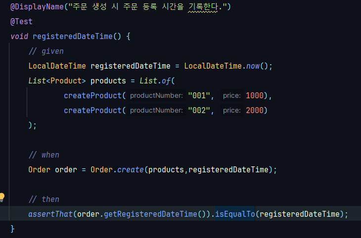
        * #### OrderProduct 만들기
          * 
        * #### OrderResponse에 맵핑메서드 추가
          * 
          * 
        * #### OrderRepository 생성
          * 
          * 
            * #### save를 해야 pk인 id값이 존재하기 때문에
        * #### 다시 OrderServiceTest 실행 성공 -> LocalDateTime 변수로 뽑고, ActiveFile("test") 지정
          * 
        * #### 중복되는 상품번호 리스트로 주문을 생성할 수 있다 -> 테스트 코드 작성 (Red 단계)
          *  
          * #### 중복되는 번호에는 반환되는 데이터가 중복제거되어서 나옴
            * 
          * #### Map을 활용하여 상품번호(key),상품(value)로 저장하여 productNumbers를 다시 순회하면서 상품을 꺼내옴 (Green 단계)
            * 
          * #### 테스트 성공
    * ### OrderService 리팩토링 -> Blue 단계
      * 
        * #### 리팩토링 후 항상 다시 테스트 돌려볼 것 정상동작하는지
    * ### OrderService테스트 두개의 메서드가 서로 영향을 주고 있어서 전체 테스트 시 실패함 -> @AfterEach를 이용하여 데이터 클렌징 작업해줘야함
      * 
        * #### 데이터 지우는 순서 중요
      * #### OrderProductRepository 생성 -> 해당 엔티티에 쌓이는 데이터도 지워줘야하기때문
        * 
        * 
      * #### ProductRepositoryTest는 데이터 클랜징을 안해줘도 자동 롤백이 됨 why? 메타 애너테이션으로 @Transactional을 가지고 있음
        * 
    * ### httpie를 이용한 Controller 엔드포인트 테스트
      * 
      * 
    * ### OrderProduct엔티티에 order_id값이 어떻게 저장되는가 ?
      * 
  * ##  Business Layer 테스트 (3)
    * ### 요구사항 추가 -> "재고와 관련된 상품이 포함되어 있는 주문번호 리스트를 받아 주문을 생성한다" 테스트 작성 (Red 단계) 
      * 
    * ### @AfterEach 주석처리하고 @Transactinal 추가
      * 
    * ### StockEntity 생성
      * 
    * ### StockRepository 생성
      * 
    * ### OrderServiceTest -> Red 단계
      * #### 테스트 작성 -> 재고상품 저장, 재고 갯수가 제대로 줄었는지 확인 -> 실패
        * 
        * 
    * ### OrderService 구현 -> Green 단계
      * 
        * #### 1 . 재고 차감 체크가 필요한 상품들 filter 구현
          * #### 재고와 관련 있는 상품들의 타입을 filtering해주기 위해 ProductType에 메서드 추가
            * 
          * #### ProductType 단위 테스트 
            * 
      * #### 2 . 재고 엔티티 조회
        * #### StockRepository에 메서드 추가
          * 
        * #### StockRepository 테스트
          * 
      * #### 3 . 상품별 counting (key = productNumber, vale = counting)
        * 
        * ```java
               Map<String, Long> productCountingMap = new HashMap<>();
                         for (String productNumber : stockProductNumbers) {
                               productCountingMap.put(productNumber, productCountingMap.getOrDefault(productNumber, 0L) + 1);
                         }
        ```
      * #### 4 . 재고 차감 시도
        * #### Stock에 있는 quantity의 개수보다 요청으로 들어온 quantity가 더 많으면 예외를 발생시켜야함
          * 
        * #### 많지 않다면 재고 차감 진행
          * 
        * #### Stock 단위 테스트
          * 
          * 
        * #### 만약 재고보다 많은 수의 수량으로 차감 시도하면 예외 던지기
          * 
          * 
        * #### 서비스로직에서 검사를 하는데 굳이 왜 deductQuantity에서도 검사하는지?
          * #### 서비스로직에서만 쓴다는 보장이 없는 메서드이므로 deductQuantity메서드 자체에서도 보장을 해줘야함
          * #### 서비스로직에서 그럼 if문을 없애도 되지않나? -> 예외가 발생했을 떄 반환하고 싶은 메세지가 다를 수도 있기 떄문에 (사용자단까지 보여줘야할 메세지라면 Stock에서 내뱉는 메세지와 달라야함)
      * #### 재고 차감 시도에서 중복되는 001에 대한 상품을 중복횟수만큼 for문을 돌아서 테스트 실패함 (재고부족)
        * 
        * 
          * #### 중복제거를 하기위해 자료형 Set에 넣어줌 -> 테스트 성공
      * #### 테스트 작성 -> 재고가 부족한 상품으로 주문을 생성하려는 경우 예외가 발생하는지
        * 
        * 
          * #### 이렇게 작성하면 안된다는 것을 알리기 위해 todo를 남김
    * ### @Transactional 주석처리하고, deleteAllInBatch로 후속처리 -> 실패
      * 
        * #### 실행했을떄 쿼리결과를 보면 stock에 대한 quantity 차감시 update쿼리문이 나가지 않았음 -> 실패 원인
      * #### OrderService에 @Transactional를 달아주면 테스트가 통과함 -> 즉 Tx경계가 있어야 테스트 성공을 함 (Jpa의 Duty Checking기능이 작동하려면)
        * 
      * #### <strong> @Transactional을 잘 알고 쓰자! </strong>
        * #### OrderServiceTest 상에서 @Transactional을 달아주면 테스트가 잘 통과 
        * #### 하지만 실제 프로덕션 코드에서는 @Transactional이 설정되있지 않았음 -> 이대로 배포가 된다면 큰결함이 발생
        * #### 근데 어떻게 insert쿼리는 잘 나간거지 ? -> JpaReposiotry의 구현체인 SimpleJpaRepository에 @Transactional이 걸려있음
          * 
        * #### <strong>변경감지는 우리가 경계를 설정해줘야함</strong> 
    * ### OrderService 리팩터링 -> Blue 단계
      * #### 재고 차감 로직을 메서드로 분리
        * 
      * #### 가공 로직을 메서드로 분리 
        * 
      * #### 테스트 실행 -> 성공
    * ### 재고 관리 -> 동시성 고민
      * 
      * ### Lock ? '내가 화장실 칸을 사용하기 위해 화장실 칸을 직접 들어가서 내가 잠그는 것'
        * #### -> 트랜잭션 처리의 순차성을 보장하기 위한 방법 
        * #### -> DBMS마다 Lock을 구현하는 방식과 세부적인 방법이 다름
      * ### Lock의 종류
        * #### 공유 락 ?
          * #### 공유 락은 데이터를 읽을 때 사용되는 락
          * #### 공유 락끼리는 자원에 동시 접근이 가능
            * #### 즉, 하나의 데이터를 읽는 것은 여러 사용자가 동시에 할 수 있음
            * #### 공유 락이 걸린 자원에 베타 락을 걸 수 없음 (블로킹 상황)
        * #### 베타 락 ?
          * #### 베타 락은 데이터를 변경하고자할 때 사용되며, 트랜잭션이 완료될 때까지 유지됨
          * #### 베타 락은 락이 해제될 때까지 다른 모든 트랜잭션은 해당 자원에 접근(공유,베타 락 둘다)할 수 없음 (블로킹 상황)
          * #### 베타 락은 다른 트랜잭션이 수행되고 있는 데이터에 접근하여 함께 락을 설정할 수 없음
        * #### 데드 락 ?
          * #### 두 트랜잭션 모두가 블로킹 상태에 진입하여 서로의 블로킹을 해결할 수 없는 상태
            * 
        * #### 참고 -> 락은 설정 범위를 결정할 수 있는데, 락을 거는 범위에 따라 나뉨 
          * #### 락 설정 범위 : DB, 파일, 테이블, 페이지, 컬럼, 행
      * ### DB 충돌 상황(블로킹)
        * #### -> Lock 간의 경합이 발생해서 특정 트랜잭션이 작업을 진행하지 못하고 대기하는 상태
        * 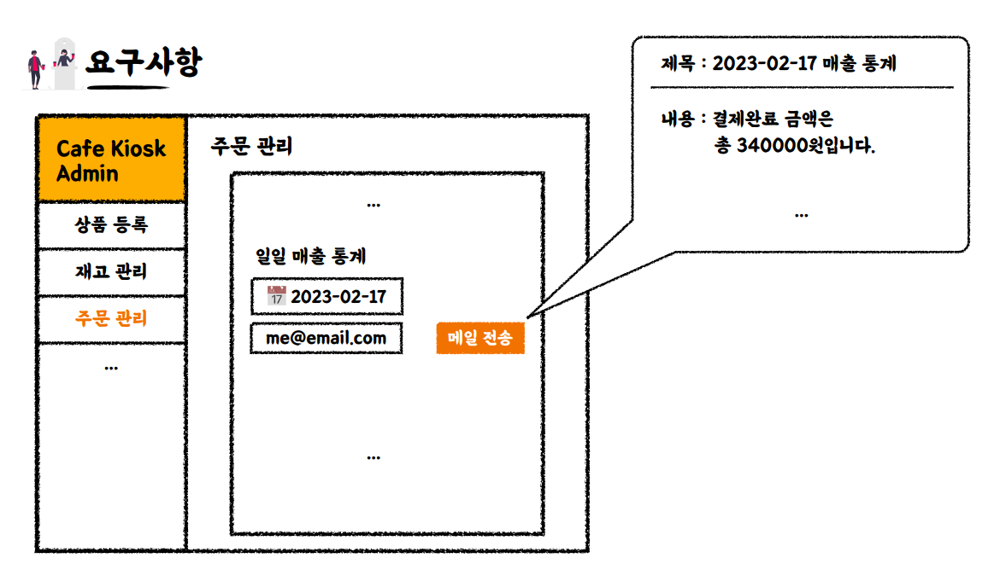
      * ### DB 충돌 상황을 개선할 수 있는 방법
        * #### 비관적 락 (Pessimistic lock) -> 자원 요청에 따른 동시성문제가 발생할것이라고 예상하고 락을 걸어버리는 방법론
          * #### 비관적 락은 Repeatable Read 또는 Serializable 수준의 격리성 을 제공
          * #### 비관적 락이란 트랜잭션이 시작될 때 공유 락 또는 베타 락을 걸고 시작하는 방법
          * #### 즉, 공유 락을 걸게 되면 write를 하기위해서는 베타 락을 얻어야하는데 공유 락이 다른 트랜잭션에 의해서 걸려 있으면 해당 락을 얻지 못해서 업데이트를 할 수 없음
          * #### 수정을 하기 위해서는 해당 트랜잭션을 제외한 모든 트랜잭션이 커밋 되어야함
        * #### 낙관적 락 (Optimistic lock) -> 자원에 락을 걸어서 선점하지말고, 동시성 문제가 발생하면 그때 가서 처리 하자는 방법론
          * #### 낙관적 락은 구분 컬럼을 두어 수정할 때 지금 수정하려는 데이터가 구분 컬럼의 값이 가장 최신 값인지 확인한 후 가장 최신 값이라면, 값을 수정할 수 있도록 하고, 아니라면 재 요청을 보내도록 하여 DB 충돌 상황을 개선하는 락
          * #### 낙천적 락은 DB에서 제공해주는 특징을 이용하는 것이 아닌 Application Level에서 잡아주는 Lock
  
  * ## Presentation Layer 테스트 (1)
    * 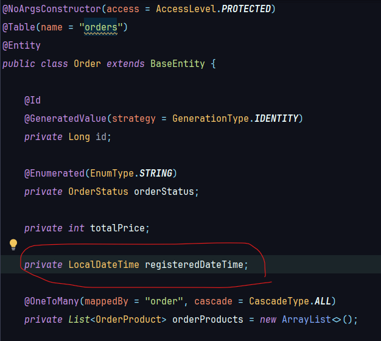
    * 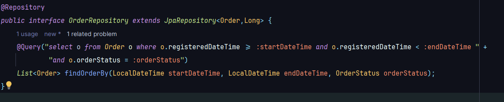
    * ### Mock ? (가짜, 대역..)
      * ### MockMvc ? 
        * 
    * ### 요구사항 추가
      * 
      * 
    * ### ProductController에 상품생성하는 Post 메서드 추가
      * 
      * #### ProductCreateRequest 생성
        * 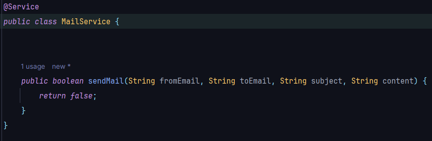
          * #### id는 db에 insert할 시 자동 생성되므로 제외
    * ### ProductService에 추가된 createProduct 메서드 구현
      * 
      * 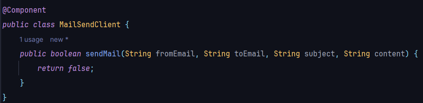
      * #### productRepository에 findLatesProduct메서드 생성 
        * 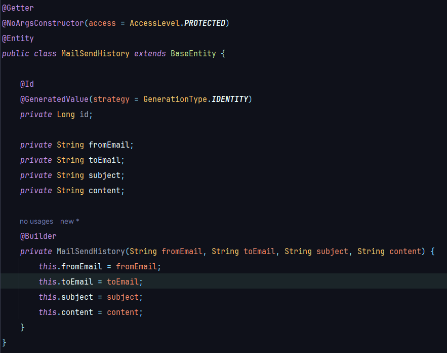
      * #### findLatesProduct메서드 테스트 작성
        * 
        * 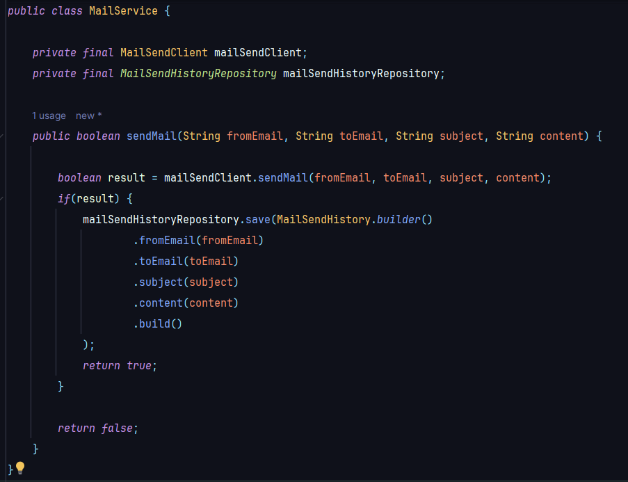
    * ### ProductService - createProduct 메서드 TDD (Red 단계) 
      * 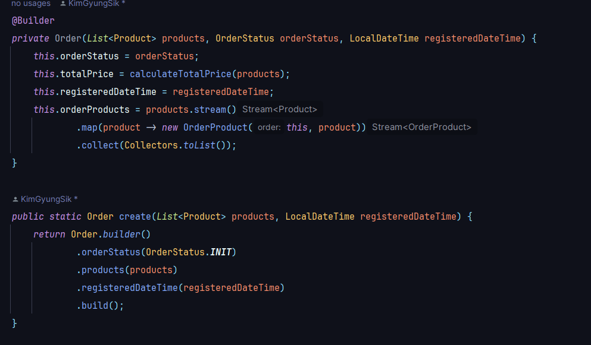 
      * 
    * ### createProduct 메서드 TDD (Green 단계)
      * 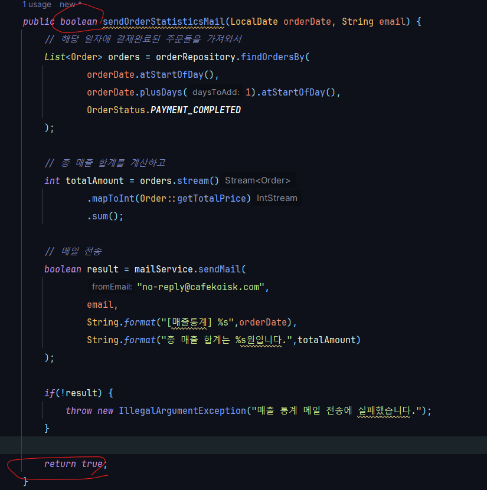
        * #### 과장해서 작성한 것 -> 빠르게 초록불을 보기 위해
      * 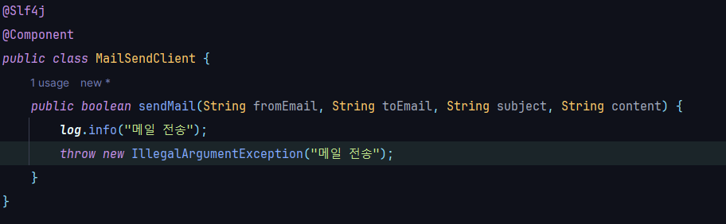
        * #### 실제 구현 -> 테스트 성공
    * ### createProduct 메서드 추가 정책 -> 상품이 하나도 없는 경우 신규 상품을 등록하면 상품번호는 001이다.
      * 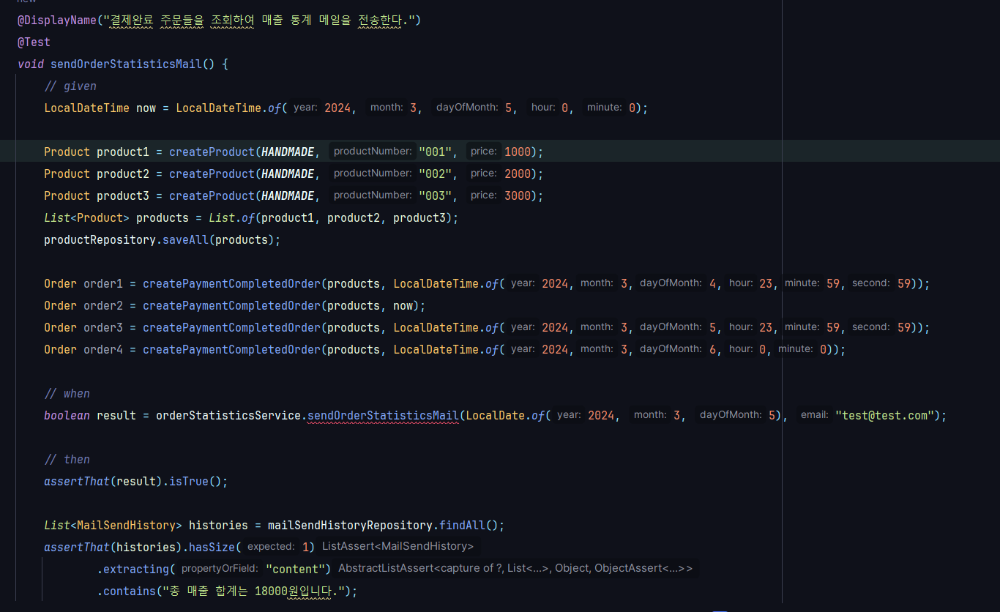
        * #### 실패
      * 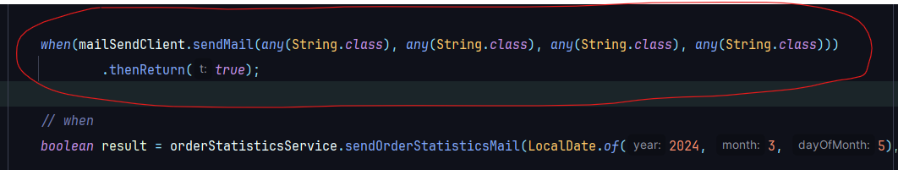
      * 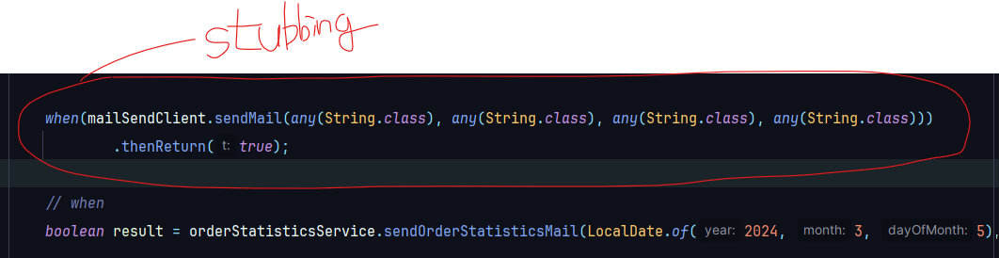
        * #### 성공
    * ### createProduct 메서드 -> 동시성 이슈..
      * #### 해결방안 1. productNumber에 unique 제약 조건을 걸고 만약 unique 제약 조건 위배가 발생하면 -> 3회 이상 재시도하는 로직 실행
      * #### 해결방안 2. UUID 사용 -> 동시성 생각할 필요는 없어짐
    * ### createProduct 메서드 TDD (Blue 단계)
      * #### 생각해보니 product를 저장을 안했음 ㅋㅋ 
      * 
      * 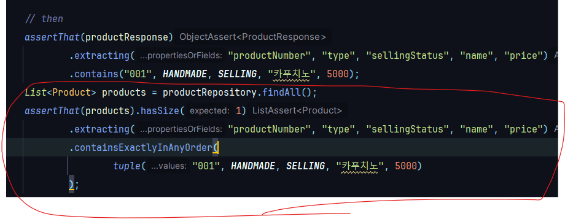
      * 
      * 
      * 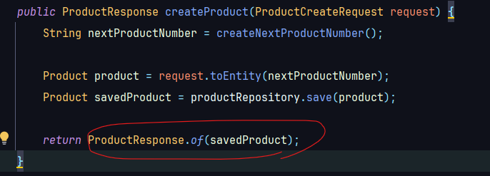
        * #### 리팩터링 완료
    * ### @Transactional(readOnly = true) ?
      * #### 읽기전용 
      * #### CURD 에서 CUD 동작 X / only Read
      * #### JPA : CUD 스냅샷 저장, 변경감지 X (성능 향상)
      * #### CQRS - Command / Query  -> 커맨드용 서비스(readOnly = false)와 쿼리용 서비스(readOnly = true)를 분리하자 !!
    * ### readOnly = true 라는 것을 쿼리용 메서드(R)와 커맨드용 메서드(CUD) 행위에 잘 나눠서 달자!!
      * #### createProduct -> Create 작업 (커맨드 작업)
        * 
          * #### 클래스 상단에 readOnly = true를 걸고 CUD 작업이 있다면 @Transactional을 메서드 단위에 걸자

  * ## Presentation Layer 테스트 (2)
    * ### ProductController 테스트 작성
      * 
      * 
        * #### @MockMvcTest : 컨트롤러와 관련된 빈들만 로드하여 테스트 환경을 구성, 웹 계층에 대한 테스트만 수행하며, 서비스, 리포지토리, 데이터베이스 관련 빈들은 로드하지 않음
        * #### @MockBean : 컨테이너에 Mockito로 만든 Mock객체를 넣어주는 역할
      * 
        * #### ObjectMapper : JSON과 Object간의 직렬화, 역직렬화를 도와줌
        * #### 테스트 실패 -> @EnableJpaAuting 관련 빈 생성을 못함 -> Config 분리
          * 
      * 
        * #### @RequestBody 추가
      * 
        * #### ProductCreateRequest에 기본 생성자 추가 -> ObjectMapper가 역직렬화를 도와주는데 (JSON으로 들어온 값을 String으로 직렬화되서 들어온 값을 ProductCreateRequest로 다시 맵핑해줘야함) 이떄 ObjectMapper가 해당 클래스 기본 생성자를 사용함
      * 
      * 
        * #### andDo(MockMvcResultHandlers.print()) 추가 -> 요청이 어떻게 날라갔는지 상세하게 확인이 가능함
      * #### ProductCreateRequest에 Validation 기능 추가
        * 
        * 
        * 
      * #### ApiResponse 생성 -> 공통적으로 사용할 수 있는 응답 포맷
        * 
        * 
        * 
      * #### ApiControllerAdvice 생성 -> Validation 예외처리를 위해
        *  
        * 
        * ####  @ResponseStatus 추가 -> 해당 예외가 발생했을 떄 어떤 코드로 줄 거야~를 정하는 것
          * 
      * #### ApiResponse -> Geterr 추가(Getter기반으로 JSON 생성) / ApiControllerAdvice -> @RestControllerAdivce로 수정
        * 
        * 
      * #### Validation 예외 테스트 작성 
        * 
        * 
        * 
        * 
    * ### @NotNull, @NotBlank, @NotEmpty
      * #### @NotNull : 스트링의 기준으로 빈 문자열 ("") 혹은 공백이 있는 문자열 ("  ")이런 것들은 통과됨
      * #### @NotEmpty : 공백 ("   ")은 통과함 하지만 빈 문자열("")은 거름
      * #### @NotBlank : 공백, 빈 문자열 둘다 안됨
    * ### 상품 이름을 20자 제한 -> 이걸 여기서 검증하는게 맞나? 라는걸 고민해봐야함
      * #### 상품 이름을 20자 제한이라는 정책 -> 컨트롤러 레이어에서 튕겨낼 책임이 맞는가에 대한 고민을 해보라는 것
      * #### 문자열이라면 합당이 가져야 할 그런 속성들에 대한 Validation과 이런 도메인 정책에 맞는 도메인 성격에 맞는 상품 이름을 20자 제한한다는 것과 같은 더 특수한 형태의 Validation을 구분할 줄 아는 고민을 해야함
      * #### ex) 컨트롤러 단에서는 NotBlank에 대해서만 validation / 상품 이름을 20자 제한은 조금 더 안쪽인 서비스 레이어 or 도메인 객체(Product 생성 시점) 생성자에서 validation
    * ### ProductController - getSellingProducts 메서드 테스트 작성
      * 
      * 
        * #### productService.getSellingProducts() -> 서비스 레이어에서 이미 다 테스트가 된 부분이기 떄문에
        * #### Array형태가 잘 오는가에 대한 것만 검증하면 됨
    * ### OrderController 테스트 작성
      * 
        * #### OrderCreateRequest에 검증할 필드에 애노테이션 달아줌
      * 
        * #### ApiResponse로 감싸서 반환, @Valid 추가
      * 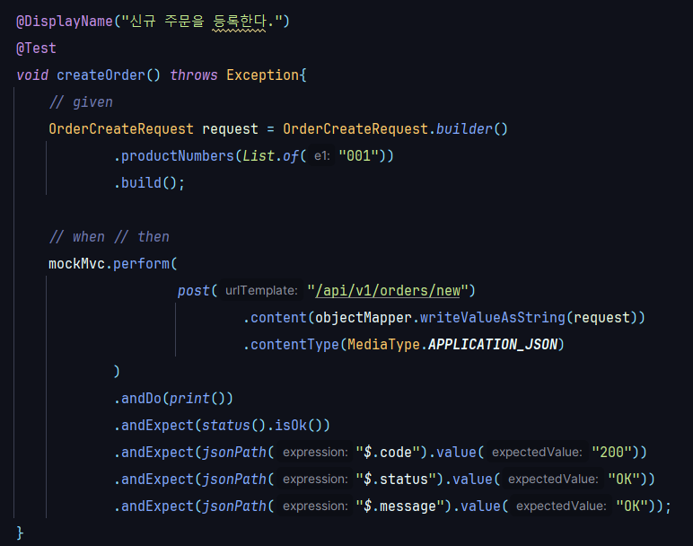
      * 
    * ### 리팩토링 -> DTO로 인한 의존성 문제 해결 (서비스 -> 컨트롤러 : 서비스가 컨트롤러를 알고있다)
      * #### 서비스 메서드의 파라미터에서 컨트롤러의 DTO를 사용하다 보니 의존 관계가 생김 
        * 
      * #### 서비스가 커지게 되었을떄, 서비스 레이어와 컨트롤러 레이어를 분리하고 싶은데 해당 DTO를 서비스 레이어에서 사용하는 것이 허들이 됨
      * #### 하위 레이어가 상위 레이어를 알고 있다는 것은 안좋음 그림
      * #### 서비스용 Request DTO를 따로 만들기 (OrderCreateRequest (컨트롤러 레이어 DTO) -> OrderCreateServiceRequest (서비스 레이어 DTO) )
        * 
        * 
        * 
          * #### Controller에서 OrderCreateRequest를 OrderCreateServiceRequest로 변환에서 넘겨줌
        * 
      * #### 이렇게 되면 -> 서비스 레이어는 클린한 POJO 형태의 DTO로 관리를 하게되고, 컨트롤러 DTO에서만 validation 책임을 가져갈 수 있도록 책임분리가 되었음
      * #### 가장 바깥쪽에 있는 프레젠테이션 레이어가 변경되어도 서비스 레이어는 영향 받지 않도록 설계해야함
      * #### ProductCreateRequest -> ProductCreateServiceRequest 똑같이 리팩토링 
        * 
          * #### 이제 Entity로 변환하는 메서드는 ProductCreateServiceRequest가 가짐
        * 
        * 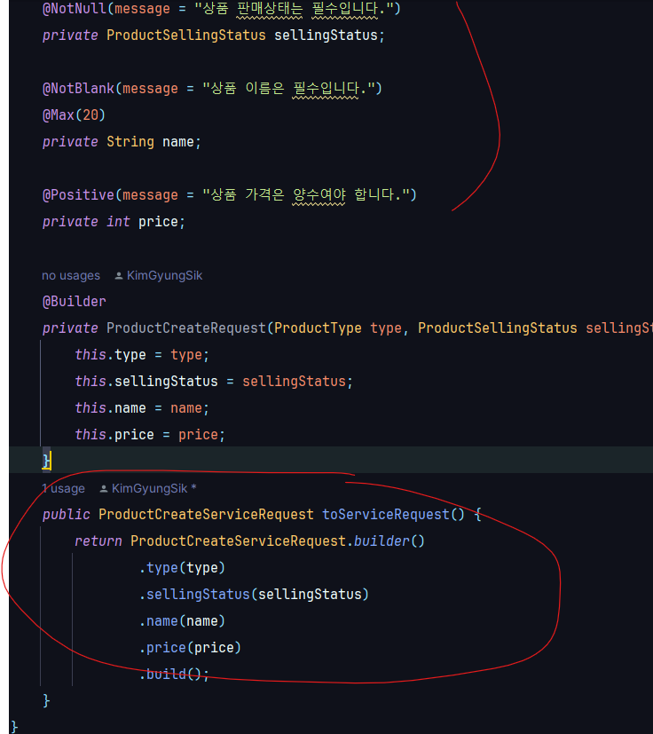
          * #### ProductCreateRequest는 validation 책임만 가짐
        * 
          * #### 서비스 레이어에서는 ProductCreateServiceRequest를 사용


  * ## 키워드 정리
    * 
      * ### Layered Architecture / Hexagoanl Architecture : 작은 시스템 / 커질수 있는 시스템에 용이
    * 
    * 
    * 
      * ### validation 할때 중요한 것! 
        * ### 도메인 요구사항에서 나온 validaiton과 기본적으로 그 타입이 갖고 있어야 되는 validation의 차이를 구분하고 
        * ### 컨트롤러에서는 최소한의 검증(진짜 문자열 다운지에 대한 검증)만을 하고 실제 도메인 레이어에서 검증해야 될 혹은 서비스 레이어에서 검증해야 될 것들은 그쪽에서 검증해서 예외(custiom Exception)를 발생시키자
        

* 